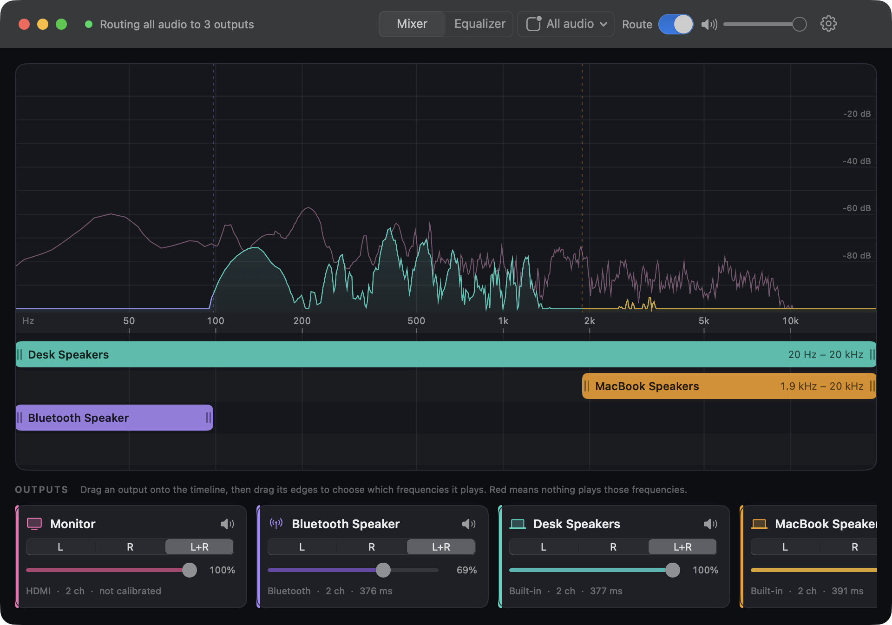
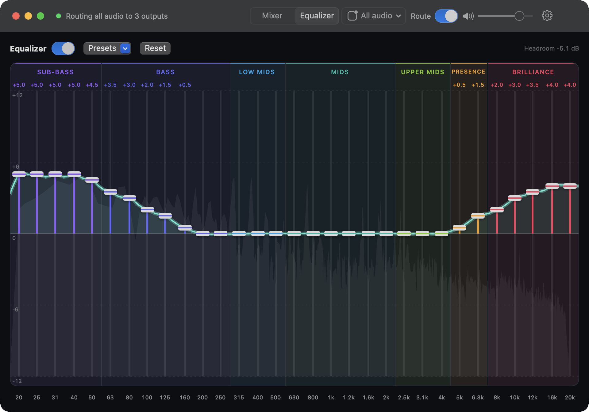

<p align="center">
  
</p>

<h1 align="center">iMix</h1>

<p align="center"><b>Split your Mac's audio across speakers by frequency.</b><br>
Turn a Bluetooth speaker into a second subwoofer, add an EQ, and keep everything in sync.</p>

<p align="center">
  
</p>

## Features

- **Frequency timeline.** Drag a speaker onto the timeline, then drag its edges to choose which frequencies it plays. Gaps show up red.
- **Any mix of speakers.** Wired, built-in, HDMI and Bluetooth together, each with its own L / R / L+R, volume and mute.
- **31-band equalizer.** Grouped into sub-bass, bass, mids, presence and more, with presets and automatic clipping protection.
- **Auto-sync.** Calibration measures each speaker's delay with your mic and lines them all up.
- **Your choice of source.** Route all system audio, or only the apps you pick.
- **Volume keys.** The Mac's volume keys control every speaker at once.

<p align="center">
  
</p>

## Install

Requires **macOS 14.2+** and **Xcode** (or its command-line tools).

```sh
git clone https://github.com/standon99/iMix.git && cd iMix
./scripts/install.sh      # builds and copies iMix.app to /Applications
```

On first launch, allow **system audio recording**. Calibration also asks for the **microphone**.

## Quick start

1. **Mixer:** drag speakers from the bottom row onto the timeline and set each one's range. For example, Bluetooth speaker **20–100 Hz**, desk speakers **20 Hz–20 kHz**.
2. **Route** (toolbar): turn it on. Audio is now split across your speakers. Turn it off to go back to normal.
3. **Settings → Calibrate:** sit where you listen, press Start, then **Apply**.
4. **Equalizer** (toolbar): shape the sound. It applies while Route is on.
5. **Settings → General:** optionally open iMix at login.

**Good to know**
- With a Bluetooth speaker in the mix, everything is delayed by about **0.4 s** to stay in sync. That's fine for music, but video will be out of lip-sync.
- iMix doesn't need a Multi-Output Device; it builds its own. Set your Mac's sound output to a real device so the volume keys work.
- If iMix quits or crashes, audio goes straight back to normal.

## Troubleshooting

| Problem | Try |
|---|---|
| Speakers out of step | Recalibrate whenever you add or remove a Bluetooth speaker. |
| Crackling | Check `~/Library/Application Support/iMix/diagnostics.json`: `discontinuities` should stay at 0. If it does, test the speaker without iMix; it may be the Bluetooth link. |
| Silence with Route on | Nothing is on the timeline, or the speakers are muted. The status at top left explains which. |
| Calibration "Not heard" | Turn that speaker up and pick the Mac's built-in mic. |

<details>
<summary><b>How it works</b></summary>

```
apps / system ─► Core Audio process tap (muted while routing)
                     │
                     ▼
     private aggregate device: tap + every routed speaker
     (Bluetooth is the clock; wired speakers get drift correction)
                     │  one IO callback
                     ▼
     31-band EQ ─► per speaker: Σ clips (Linkwitz-Riley band-passes)
                                → L / R / L+R → gain → sync delay
```

- **Clips** are 4th-order Linkwitz-Riley band-passes, so neighbouring speakers cross over cleanly.
- **Calibration** plays log sweeps through the same aggregate the router uses, records the mic on the same clock, and finds each arrival by FFT cross-correlation. Only the differences between speakers are applied as delay.
- **The EQ** solves for its filter gains so the curve passes exactly through each fader.
- iMix leaves your devices alone: no sample-rate changes, and it never opens a speaker's mic (which would force Bluetooth into call quality). All-audio capture excludes iMix itself, so there's no feedback.
</details>

<details>
<summary><b>Development</b></summary>

```sh
./scripts/run.sh          # build release, bundle into build/iMix.app, launch
./scripts/run.sh debug    # unoptimized (too slow for real use)
./scripts/make_icon.sh    # re-render the app icon
```

Open `Package.swift` in Xcode to edit. Sources live in `Sources/iMix/` (`Audio/` engine, router, calibration; `UI/` SwiftUI views; `Model/` saved profile). Settings are stored in `~/Library/Application Support/iMix/profile.json`.

`open build/iMix.app --args --calibrate-to /tmp/cal.json` runs a calibration without the UI and writes the results as JSON.
</details>

---

<p align="center"><sub>Designed by Siddhant Tandon, 2026</sub></p>
