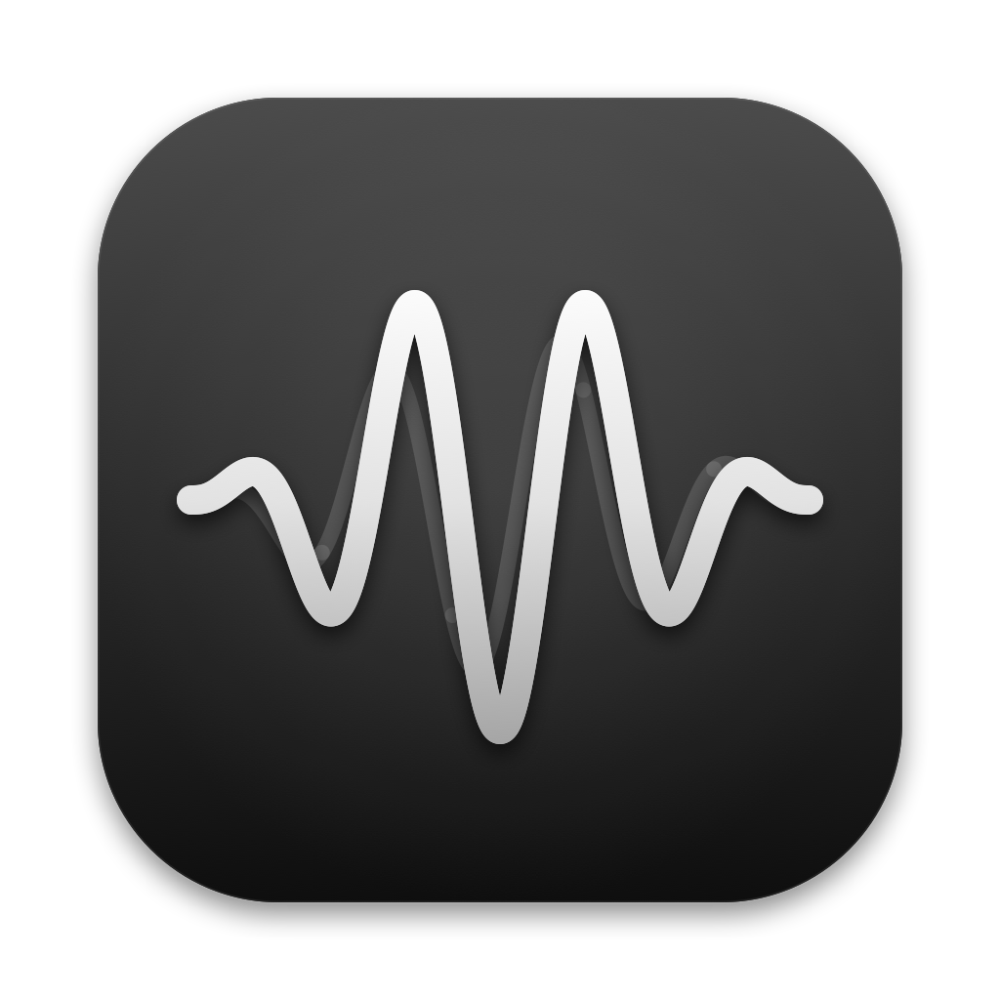

<p align="center">
  
</p>

<h1 align="center">iMix</h1>

<p align="center">Split your Mac's audio across several speakers by frequency, like a home-made crossover or surround setup.</p>

---

iMix captures what your Mac is playing (everything, or just the apps you pick), mutes it at the source, and plays it back through any combination of speakers. Each speaker gets only the frequencies you assign it, with its own channel, volume and delay. A typical use is pairing a Bluetooth speaker as a second subwoofer alongside wired desk speakers.

## Features

- **Frequency timeline (Mixer).** A live spectrum with a timeline underneath. Drag a speaker onto the timeline, then drag the clip's edges to choose its frequency range. Clips stack in rows, and frequencies nothing covers are shaded red.
- **Per-speaker controls.** Each speaker gets L / R / L+R, volume and mute, which apply to all of its clips.
- **31-band equalizer.** Third-octave faders (±12 dB) grouped into sub-bass, bass, low mids, mids, upper mids, presence and brilliance, with presets. The response curve passes exactly through every fader, and boosts get automatic headroom so they don't clip.
- **Source picker.** Route all system audio, or tick specific running apps (Spotify, Safari, Chrome…) and leave everything else alone.
- **Master volume.** Follows the Mac's volume keys and scales every output together.
- **Calibration.** Plays a sweep through each speaker, listens with the mic and measures latency. Every output is then delayed to line up with the slowest one, usually the Bluetooth speaker.

## Requirements

- macOS 14.2 or later (process taps)
- Xcode (or its command-line tools) to build

## Build & run

```sh
./scripts/run.sh            # optimized build, wrapped in build/iMix.app, then launched
./scripts/run.sh debug      # unoptimized build (too slow for real use with the EQ on)
NO_LAUNCH=1 ./scripts/run.sh
```

The script builds with SwiftPM, wraps the binary in an ad-hoc-signed `.app` (macOS only grants audio-capture and microphone permission to app bundles) and opens it. On first launch, allow **system audio recording**. Calibration will also ask for the **microphone**.

To install a stable copy in `/Applications` (recommended if you turn on **Open iMix at login**, since `build/iMix.app` is recreated on every build):

```sh
./scripts/install.sh
```

To open the code in Xcode, open `Package.swift`.

## Using it

1. **Pick a source** in the toolbar: *All audio*, or tick the apps you want.
2. **Mixer:** drag speakers from the bottom row onto the timeline and set each clip's range. For example:
   - Bluetooth speaker as a sub: **20 Hz – ~100 Hz**, L+R
   - Desk speakers + wired sub: **20 Hz – 20 kHz** (the wired sub's own crossover still works)
3. **Turn on Route.** The captured audio is muted at its source and played through your clips. Turn it off and everything plays normally again. If iMix quits or crashes, the audio comes back by itself.
4. **Calibrate** (Settings → Calibrate): sit where you listen, keep the room quiet, then Start → **Apply**. Recalibrate whenever you add or remove a Bluetooth speaker.
5. **Equalizer:** switch to the Equalizer page. It applies while Route is on.
6. **Settings → General:** turn on *Open iMix at login* to have it start with your Mac.

### Good to know

- With a Bluetooth speaker routed, **everything is delayed by roughly 0.4 s** so the speakers stay in sync. That's fine for music, but video will be out of lip-sync. For video, remove the Bluetooth clip or use Route only for your music app.
- The volume keys only work when the Mac's sound output is a real device. Multi-Output Devices have no volume control. iMix doesn't need a Multi-Output or Aggregate device; it creates its own private one.

## How it works

```
App(s) / system ──► Core Audio process tap (muted while routing)
                         │
                         ▼
          Private aggregate device: tap + every routed output
          (wired output is the clock, drift compensation on the rest)
                         │  one IO callback
                         ▼
          31-band graphic EQ ──► per output:
                                   Σ clips (LR4 high-pass + LR4 low-pass)
                                   → L / R / L+R → gain → calibration delay
```

- **Clips** are Linkwitz-Riley 4th-order band-passes. Where two speakers' clips meet, the crossover sums flat when they're aligned in time.
- **Calibration** builds the same aggregate the router uses, plus the mic, then plays a 150 Hz–12 kHz log sweep five times per speaker. It records on the same sample timeline and finds the direct sound by FFT cross-correlation (first strong peak, sub-sample interpolation). The raw latencies include buffering macOS adds when Bluetooth and wired devices share an aggregate. Only the differences matter, and that's what's applied as delay.
- **The EQ** solves for its 31 filter gains from an interaction matrix, so overlapping bands don't overshoot the faders.
- **All-audio capture** excludes iMix's own process so its output is never captured again (no feedback).

## Troubleshooting

| Symptom | Likely cause / fix |
|---|---|
| Crackling on the Bluetooth speaker | Check `~/Library/Application Support/iMix/diagnostics.json`. `discontinuities` > 0 or a high `maxLoadPercent` means the audio callback is struggling (make sure you're on the release build). If both are clean, try the speaker directly from macOS Sound settings; if it crackles there too, it's the Bluetooth link. |
| Speakers sound out of step | Recalibrate and click Apply. Latencies change when you add or remove a Bluetooth speaker or change sample rate. |
| Calibration says "Not heard" | The speaker's volume is too low or it's off, or the wrong mic is selected (pick the Mac's built-in mic). |
| Silence with Route on | Nothing is on the timeline, or every clip's speaker is muted / at 0%. The status at top left says which. |
| Permission prompts after every rebuild | Ad-hoc signing changes each build; click Allow. |

## Project layout

```
Sources/iMix/
  App/      IMixApp (entry point), LegacyMigration (carries settings over from earlier names)
  Audio/    AudioEngine (taps, sessions, master volume, app discovery), Router (EQ, clip filters,
            per-device rendering), AggregateDevice + ProcessTap, Calibration, SpectrumFeed (FFT),
            DeviceManager, CoreAudioUtils
  Model/    Profile (clips, devices, EQ), ProfileStore (edits + persistence)
  UI/       MainView, Toolbar, SpectrumEditorView + SpectrumCanvas (mixer), EqualizerView,
            DeviceSticker, SettingsView (calibration), GeneralSettingsView (login item, About), Theme
Resources/  Info.plist, Icon/ (icon-1024.png, AppIcon.icns)
scripts/    run.sh (build + bundle + launch), install.sh (copy to /Applications),
            make_icon.sh + make_icon.swift (icon)
```

Settings and calibration are saved to `~/Library/Application Support/iMix/profile.json`.

### Developer notes

- `open build/iMix.app --args --calibrate-to /tmp/cal.json [--outputs uid1,uid2]` runs a headless calibration and writes the results as JSON.
- `./scripts/make_icon.sh` re-renders the icon and rebuilds `AppIcon.icns`.
